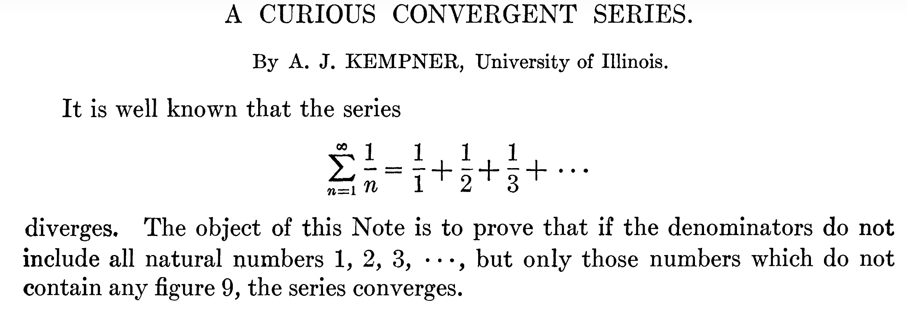
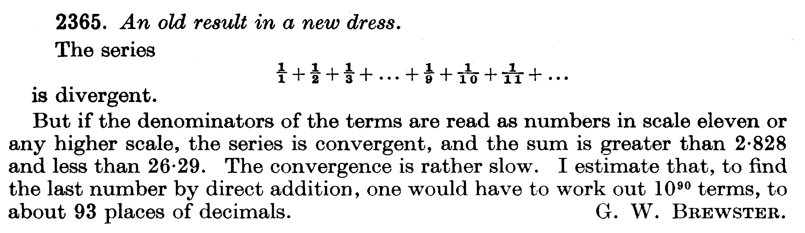
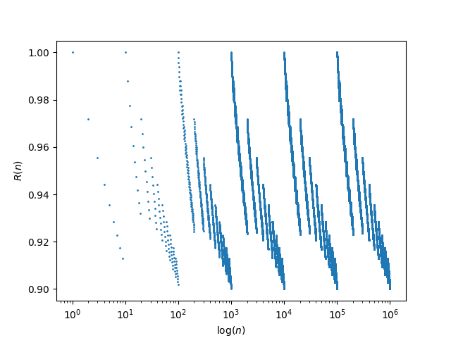
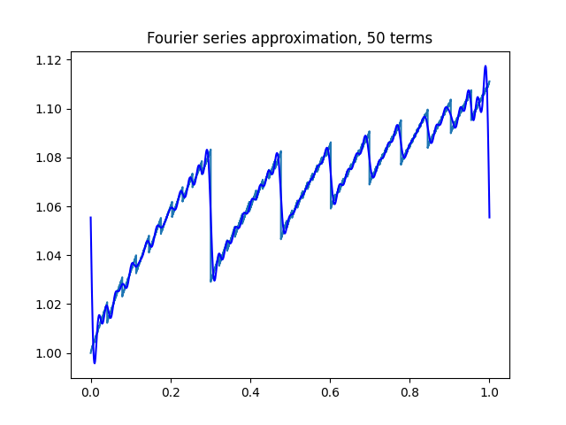

#+Title: A difficult prime series problem
#+Author: Victor S. Miller
#+Date: 2 April, 2026
#+Email: victorsmiller@gmail.com
#+Latex_header: \titlegraphic{\large \text{Rutgers Experimental Mathematics Seminar}}
#+Latex_header: \institute{Anduril Industries}
#+startup: beamer
#+LaTeX_CLASS: beamer
#+LaTeX_CLASS_OPTIONS: [presentation]
#+LANGUAGE:  en
#+OPTIONS:   H:1 num:t toc:nil \n:nil @:t ::t |:t ^:t -:t f:t *:t <:t
#+OPTIONS:   TeX:t LaTeX:t skip:nil d:nil todo:t pri:nil tags:not-in-toc
#+INFOJS_OPT: view:nil toc:nil ltoc:t mouse:underline buttons:0 path:https://orgmode.org/org-info.js
#+columns: %45ITEM %10BEAMER_env(Env) %10BEAMER_act(Act) %4BEAMER_col(Col) %8BEAMER_opt(Opt)
#+BEAMER_THEME: PaloAlto [height=20pt]
#+beamer_color_theme:
#+beamer_font_theme:
#+beamer_inner_theme:
#+beamer_outer_theme:
#+beamer_header:
#+latex_header: \usepackage{relsize}
#+latex_header: \newcommand{\cL}{\mathcal{L}}
#+latex_header: \newcommand{\cS}{\mathcal{S}}
#+latex_header: \newcommand{\cP}{\mathcal{P}}
* A challenge from Neil Sloane                                      :B_quote:
:PROPERTIES:
:BEAMER_env: quote
:END:
Let $V(n)$ mean: write $n$ in base 10 but read it as if it were
base 11.  E.g. $V(27) = 2*11 + 7 = 29$. $V(n)$ is A171397.  $V$ is
interesting because although the harmonic series $\sum 1/n$ diverges,
it is a classic result that $S1 = \sum 1/V(n)$ converges.  The decimal
expansion of $S1$ is in A375805, but only 3 decimal places are known.

Second, $V(\text{prime}_n)$ is A031216. What is $S2 = \sum
1/V(\text{prime}_n)$?  Its value is in A375863, but only 1 decimal
place is known.  Could someone calculate $S1$ and $S2$ more
accurately?

As William Cheswick always says, "If brute force doesn't work, use more
brute force".
* History
** Kempner (1914)

** Brewster (1953)

* Ellipsephic Series and Automatic Dirichlet series
- Series with digit conditions: "Ellipsephic" (due to Christian
  Mauduit).
- After Kempner: huge literature.
- Many involving hard Analytic Number Theory.
- None (as far I could find) involve series over primes like the
  second series.
* A few words about complexity
- What is the complexity of finding an $N$ digit approximation to a quantity?
- Ideally it is polynomial in $N$ (and small degree).
- In these two problems, brute force is exponential in $N$.
- The method presented here is also exponential, but with a much
  smaller base.
* Summing of Series
We're summing \(A = \sum_{k=1}^\infty a_k\).
Brute force: 
\begin{displaymath}
A = \underbrace{a_1 + \dots + a_n}_{\textbf{Head}}
\,+\,\underbrace{a_{n+1} + \dots}_{\textbf{Tail}}
\end{displaymath}
- Calculate the /head/ and hope that the /tail/ is negligible.
- In this case, we'll see that it isn't.
* The first series
- Easily handled by methods of Robert Baillie and Jean-François Burnol.
- They implicitly involve finite automata and regular languages.
- Doesn't appear to apply to second sum.
- "Automaticity": how well a set of words (in our case digits) is
  approximated by a regular set (larger is worse).
- Thomas Dubbe recently show that the set of prime digits has
  close to maximal automaticity.
* Simple Bounds
- \(\alpha = \log 11 / \log 10 \approx 1.041392685158225\).
- \(10^k \le n < 10^{k+1}\) then \(11^k \le n^\alpha < 11^{k+1}\).
Then
\[11^k = V(10^k) \le V(n) \le \sum_{j=0}^k 9 \cdot 11^j <
  \frac{9}{10} 11^{k+1}.\]

Thus
\[
\frac{1}{11} < \frac{V(n)}{n^\alpha} < \frac{99}{10}.
\]
- Write $R(n) := \frac{V(n)}{n^\alpha}$.
* \(R(n)\) in log scale
#+caption: It looks periodic (almost: it's self similar)

* Improved Bounds
*** Improvement
Using *Karamata's inequality* arguments we can show:
If \(10^k \le n < 10^{k+1}\) then
\[
1  = R(10^k) \ge R(n) \ge R(10^{k+1} - 1) > \frac{9}{10},
\]
which is asymptotically tight.
* Why Brute force won't work (in this lifetime)
** Tail Bounds                                                     :B_block:
:PROPERTIES:
:BEAMER_env: block
:END:
From last inequalities, for $k$ decimal places of accuracy, for the
first series, needs at
least
$m = c 10^{k/(\alpha-1)}$ terms, where $c \approx 2.18189 \times 10^{-11}$.
|---------------+--------+---------+---------|
| $k$           |      1 |       2 |       3 |
|---------------+--------+---------+---------|
| $\log_{10} m$ | 13.497 | 37.6565 | 61.8154 |
|---------------+--------+---------+---------|

For the prime series we only gain a factor of $k$. Still not feasible.
* Strategy
- \(\cP\) is the set of primes.
- \(\sum_{p \in \cP} \frac{1}{V(p)} = \sum_{p \in \cP} \frac{1}{R(p)}
  \frac{1}{p^\alpha}\)
- Prime zeta function: \(P(s) := \sum_{p \in \cP}
  \frac{1}{p^s}\) for \(s > 1\).
- Good algorithms exists for evaluating \(P(s)\).
- Estimate the tail by using bounds for \(R(n)\).
- Original bounds only buys 1 extra place of accuracy :-(.
* Using Leading digits.
** Leading Digits                                                  :B_block:
:PROPERTIES:
:BEAMER_env: block
:END:
If \(a \ge 1\), say that \(n\) has leading digits \(a\)
if there is a \(k \ge 0\) such that
\[a \cdot 10^k \le n < (a+1) \cdot 10^k\]
- \(\cL(a)\): integer with leading digits $a$.
- \(\cP_a = \cL(a) \cap \cP\).

Then
\begin{displaymath}
\begin{aligned}
R(a) = R(a \cdot 10^k) & \ge R(n) >
R((a+1) \cdot 10^k - 1) \\ & > R(a)
\left(\frac{a}{a+1}\right)^\alpha + \frac{9}{10 (a+1)^\alpha} := U(a),
\end{aligned}
\end{displaymath}
* Covering
- Every $n \ge 10^k$ has leading digits among the set
$N_k := \{10^k \le a <   10^{k+1}\}$.
- $P_a(s) := \sum_{p \in \cP_a} \frac{1}{p^s}$.
**                                                                 :B_block:
:PROPERTIES:
:BEAMER_env: block
:END:
\[ \sum_{a \in N_k} \frac{1}{R(a)} P_a(\alpha) \le
\sum_{p \ge 10^k \in \cP} \frac{1}{V(p)} 
< \sum_{a \in N_k} \frac{1}{U(a)} P_a(\alpha).
\]
* Good estimation
- Interval $[1/R(a), 1/U(a)]$ very small.
- When $a$ is big this is a very good approximation.
[[file:difference.png]]
* How do we calculate $P_a$?
- Characteristic function:
\begin{displaymath}
\chi_a(x) =
\begin{cases}
1 & \text{if } a\cdot 10^k \le n < (a+1) \cdot 10^k \text{ for some } k \\
0 & \text{otherwise}
\end{cases}
\end{displaymath}
- \(\chi_a(\log_{10} n) = 1\) if and only if $n \in \cL(a)$.
- Periodic function of $\log_{10} n$.
- Use Fourier series.
* Bounds
- Lower bound: \ell_k(x) := \(\sum_{a \in N_k} \frac{1}{R(a)} \chi_a(x)\)
- Upper bound: u_k(x) := \(\sum_{a \in N_k} \frac{1}{U(a)} \chi_a(x)\)
- Fourier approximation:
- \(\ell_k(x) \approx \sum_{j=-r}^r c_{k,j} \exp(2 \pi i j x)\)
- \(u_k(x) \approx \sum_{j=-r}^r d_{k,j} \exp(2 \pi i j x)\)
* Estimating the tail
**                                                                 :B_block:
:PROPERTIES:
:BEAMER_env: block
:END:
  \[\frac{\exp(2 \pi i k \log_{10} p)}{p^\alpha}=
  \frac{1}{p^{\alpha -  \frac{2 \pi i k}{\log 10}}}\]
**                                                                 :B_block:
:PROPERTIES:
:BEAMER_env: block
:END:
\begin{displaymath}
\begin{aligned}
\, & \sum_{j=-r}^r c_{k,j}
P^{(k+t)}\left(\alpha - \frac{2 \pi i j} {\log 10}\right) \lessapprox
\, & \sum_{p \in \cP, p \ge 10^{k + t}} \frac{1}{V(p)} \lessapprox \\
\, & \sum_{j=-r}^r d_{k,j} P^{(k+t)}\left(\alpha - \frac{2 \pi i j}{\log
10}\right)
\end{aligned}
\end{displaymath}
**                                                                 :B_block:
:PROPERTIES:
:BEAMER_env: block
:END:
Truncated prime zeta
\[P^{(k)}(s) := \sum_{p \in \cP, p \ge 10^k} \frac{1}{p^s}\]
* The Prime Zeta Function
- Riemann zeta function and Prime zeta function
\begin{displaymath}
 \zeta(s) := \sum_{n=1}^\infty \frac{1}{n^s}, 
\, \, P(s) := \sum_{p \text{ prime}} \frac{1}{p^s}, \Re s > 1.
\end{displaymath}
- Use Euler product, take logs and use Möbius inversion
\begin{displaymath}
P(s) = \sum_{n=1}^\infty \mu(n) \frac{\log \zeta(ns)}{n}.
\end{displaymath}
- Complex $s$.
Above is for $s$ real. If for $\log$ we use the principal value of the
logarithm, it still holds (van de Lune) when $\Re s > \sigma_- \approx
1.033908072$. Note that $\alpha > \sigma_-$. 
* Significant figures
**                                                                 :B_block:
:PROPERTIES:
:BEAMER_env: block
:END:
Using leading digits between $10^4$ and $10^5$ and 50 terms of the
Fourier series yields the value
\[ 3.0878\dots\]
#+caption: Fourier series $1/R(a)$: 50 terms
#+attr_latex: :height 0.50\textheight

* Further work
- The Fourier series approximation is fairly weak because of jumps in
  the function (this is inherent).
- Are there more efficient (i.e. non-exponential) algorithms to calculate an \(N\)-digit approximation?
- In particular, can we adapt the idea of integrating against the invariant measure (as did Burnol)?
- Or is the problem of approximating the second sum inherently hard?
* Acknowledgements
- Neil Sloane: for posing the problem
- Jeff Shallit and Jean-Paul Allouche: for helpful discussion about
  automatic sequences.
- Fredrik Johansonn: for ~mpmath~ and pointers to papers about
  computation of the prime zeta function.
* Karamata's Inequality
** Majorization                                                    :B_definition:
:PROPERTIES:
:BEAMER_env: definition
:END:
Given two nonincreasing sequences, $x$ and $y$ of length $n$, say that
$x$ *majorizes* $y$ if $\sigma_j(x) \ge \sigma_j(y)$ for $1 \le j < n$
and $\sigma_n(x) = \sigma_n(y)$, where $\sigma_j(x) := \sum_{i=1}^j
x_j$.
** Karamata's inequality                                         :B_theorem:
:PROPERTIES:
:BEAMER_env: theorem
:END:
If $f$ is a convex function and sequence $x$ majorizes sequence $y$,
then $\sigma_n(f(x)) \ge \sigma_n(f(y))$.
**                                                                 :B_block:
:PROPERTIES:
:BEAMER_env: block
:END:
Suggested by ChatGpt. But it got the sense of the inequality wrong!
* Tight Inequalities
** Sequences                                                       :B_block:
:PROPERTIES:
:BEAMER_env: block
:END:
- $n = \sum_{i=0}^{k-1} d_i \cdot 10^i$, with $0 \le d_i < 10$ and $d_{k-1} > 0$.
\begin{displaymath}
\cS(n) := \underbrace{\frac{10^{k-1}}{n}}_{d_{k-1} copies}
\cdots
\underbrace{\frac{10^0}{n}}_{{d_0} copies}
\end{displaymath}
- $f(x) = x^\alpha$ - convex.
- $\sigma(f(\cS(n))) = R(n)$.
- $\cS(a \cdot 10^k)$ (padded with 0's) majorizes $\cS(a \cdot 10^k +
  d)$, $0 \le d < 10^k$: easy.
- $\cS(a \cdot 10^k + d)$ majorizes $\cS((a+1) \cdot 10^k - 1)$: ugly.
* An exact expression
** Perron Summation Formula                                        :B_block:
:PROPERTIES:
:BEAMER_env: block
:END:
\begin{displaymath}
\sum_{1 \le k < n} \lambda_k + \frac{\lambda_n}{2}
= \frac{1}{2 \pi i} \int_{c - i \infty}^{c + i \infty}
 \left( \sum_{k \ge 1} \frac{\lambda_k}{k^s} \right)
n^s \frac{ds}{s}.
\end{displaymath}
** Difference                                                      :B_block:
:PROPERTIES:
:BEAMER_env: block
:END:
$\lambda _n := V(n) - V(n-1) = \frac{11^{\nu_{10}(n)} + 9}{10}$,
where $\nu_{10}(n)$ is the largest power of 10 dividing $n$.
**                                                                 :B_block:
:PROPERTIES:
:BEAMER_env: block
:END:
\begin{displaymath}
V(n) = \frac{11^{\nu_{10}(n)}}{20} + n^\alpha F(\log_{10}(n)),
\end{displaymath}
where $F$ is continuous and periodic with period 1.
