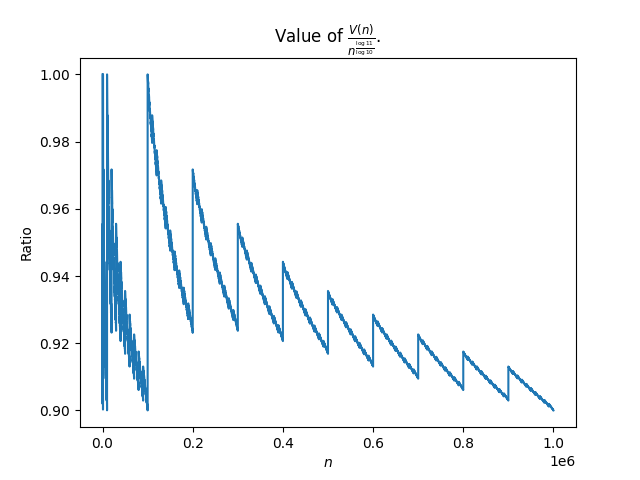

#+Title: A letter to Nick Trefethen
#+Author: Victor S. Miller
#+latex_header: \usepackage{amsthm}
#+latex_header: \usepackage{amsmath}
#+latex_header: \usepackage{amsfonts}
#+latex_header: \usepackage[T1]{fontenc}
#+latex_header: \DeclareMathOperator{\sinc}{sinc}
#+latex_header: \DeclareMathOperator{\Li}{Li}
#+latex_header: \DeclareMathOperator{\Ei}{Ei}
#+latex_header: \newtheorem{lemma}{Lemma}
#+latex_header: \newtheorem{definition}{Definition}
#+bibliography: ~/BibFiles/zeta.bib
#+bibliography: ~/BibFiles/series.bib
#+bibliography: ~/BibFiles/digits.bib
#+cite_export: biblatex backend=bibtex,style=alphabetic,url=true

* Introduction
Hi Nick, If you recall, we exchanged emails a while back. I just saw
your great talk at the CodEx seminar. I hadn't known about AAA
before. It looks quite amazing.

I've been working on the following challenging problem, first posed by
Neil Sloane:
#+begin_quote
If $n$ is a positive integer, denote by $V(n)$ the
integer which is formed by using the base 10 digits of $n$ as base 11
digits. It follows from an old observation of Kempner
[cite:@kempner1914curious] that the series
$\sum_{n=1}^\infty \frac{1}{V(n)}$ converges, so the challenge is to
find a good numerical approximation to its value. A much more
challenging version is to do the same for the subseries
$\sum_{p, \text{ prime}} \frac{1}{V(p)}$.
#+end_quote

It turns out that the first
problem falls easily to a method first described by Robert Baillie
[cite:@baillie1979sums] (and a variant of that method described by
Burnol [cite:@burnol2024moments])
which uses the recursive nature of $V(n)$. I've been able to
generalize that to approximating things like $\sum_{n \in C}
\frac{1}{n}$ where $C$ is a subset of the positive integers which is
described by restrictions of the digits in some fixed base, $b$. The
restrictions all involve finite automata. Kempner's and Baillie's are
simple examples of this.

However, to deal with the second series is very challenging. It turns
out that the set of digits of primes in a fixed base can't even be
closely approximated by finite automata
[cite:@dubbe2025automaticity]
(in a certain technical sense
that I don't have the space to go into). Some people tried to approach
both problems by summing up the initial part of the series, but
convergence is excrutiatingly slow.
* Some simple observations
In order to show the series $\frac{1}{V(n)}$ converges, we first
calculate some useful bounds on $V(n)$. If $n \ge 1$, let
$k=\left\lfloor \frac{\log n}{\log 10} \right \rfloor$.
We then have
$10^k \le n < 10^{k+1}$. Thus, if $\alpha = \frac{\log 11}{\log 10}$,
we have
$11^k \le n^\alpha < 11^{k+1}$.
But
\[11^k \le V(n) \le \sum_{i=0}^k 9 \cdot 11^i < \frac{9}{10} 11^{k+1}\].
Thus \[\frac{n^\alpha}{11} < V(n) < \frac{99}{10} n^\alpha\].
or 
\begin{displaymath}
\frac{11}{n^\alpha} > \frac{1}{V(n)} \ge \frac{10}{99 n^\alpha}.
\end{displaymath}

In order to get a handle on how hard "brute force" is we need a good
lower bound for the tail of the series
\begin{displaymath}
T(m) := \sum_{n=10^m}^\infty \frac{1}{V(n)}.
\end{displaymath}
For $m > 0$ an integer, define $I(m) := \int_{10^m}^\infty
\frac{dx}{x^\alpha}$, and $H(m) := \sum_{n=1}^{10^m-1}
\frac{1}{V(n)}$. Then, since $\frac{1}{n^\alpha}$ is decreasing, we
have $T(m) \ge \frac{10}{99}I(m)$.
By the above, we have
\begin{displaymath}
\frac{10}{99} I(m) \le \sum_{n=10^m}^\infty \frac{1}{V(n)} 
< 11 (T(m) + \int_{10^m-1}^{10^m} \frac{dx}{x^\alpha}).
\end{displaymath}
Note that $I(m) = \frac{1}{\alpha - 1} \frac{1}{10^{m(\alpha - 1)}} =
\frac{1}{\alpha - 1} (10/11)^m$.

In order to ensure that we have an accuracy of $< 10^{-r}$, it is
necessary that $\frac{10}{99}\frac{1}{1-\alpha} (10/11)^m <
\frac{1}{2}10^{-r}$,
or
$\log(c) + m \log(10/11) < -r \log(10)$,
where $c = \frac{20}{99(\alpha - 1)}$,
or
$m > \frac{r}{\alpha - 1} - \frac{\log(c)}{\log(11/10)}$.
* The series of primes
To attack the second series, involving primes, I had the idea that if
one fixes a set of leading digits of $n$ that $\frac{1}{V(n)}$ doesn't
vary very much. This can be made more precise as follows:
\begin{definition}
Let $a$ and $n$ be a positive integers. Say that $n$ \emph{has leading digits $a$} to mean that $n = a \cdot 10^k + c$, for some nonnegative integers $k$ and $c$ with $c < 10^k$.
\end{definition}
Then we have
#+begin_lemma
If $n$ has leading digits $a$, then we have
#+name: lower:upper
\begin{equation}
\ell(a) := \frac{V(a)}{(a+1)^\alpha} < \frac{V(n)}{n^\alpha} < 
\frac{V(a) + 9/10}{a^\alpha} := u(a),
\end{equation}
where $\alpha = \log 11/\log 10$.
#+end_lemma
#+begin_proof
By definition $n = a \cdot 10^k + c$, with $c < 10^k$. Thus
$$a \cdot 10^k \le n < (a+1) 10^k,$$ or

#+name: k:bound
\begin{equation}
\frac{\log n - \log (a+1)}{\log 10} < k \le \frac{\log n - \log a}{\log 10}.
\end{equation}

However, we have $V(n) = V(a) 11^k + V(c)$.
Thus
\begin{displaymath}
V(a) 11^k \le V(n) < V(a) 11^k + 9 \cdot \sum_{j=0}^{k-1} 11^j < (V(a) + 9/10) 11^k.
\end{displaymath}
Substituting the above bounds for $k$ from [[k:bound]] and simplifying yields the asserted inequalities.
#+end_proof

#+name: ratio:plot
#+caption: Ratio of $V(n)$ to $n^{\frac{\log 11}{\log 10}}$

Let $\mathcal{P}_a$ denote the
set of primes whose leading base 10 digits are $a$ and
\begin{displaymath}
R_a(s) := \sum_{p \in \mathcal{P}_a} \frac{1}{p^s}.
\end{displaymath}
We can then use these inequalities to show that
\begin{displaymath}
\frac{1}{u(a)} R_a(\alpha) <
\sum_{p \in \mathcal{P}_a} \frac{1}{V(p)} <
\frac{1}{\ell(a)}R_a(\alpha).
\end{displaymath}
As $a$ gets bigger, the
ratio $u(a)/\ell(a)$ gets closer to 1.

We can try to evaluate the upper and lower bounds by using the *prime
zeta function* $P(s) = \sum_{p, \text{ prime}} \frac{1}{p^s}$. We
discuss it in more detail in [[*Calculating \(P(s)\)][Calculating \(P(s)\)]].
It is also convenient to define the *truncated prime zeta function*
$P_a(s) = \sum_{p \ge a, \text{ prime}} \frac{1}{p^s}$.

The idea is that $n$ has leading digits $a$ if and only if
$H_a(\log n/\log 10) = 1$ and $n \ge a$, where
\begin{displaymath}
H_a(x) =
 \begin{cases}
1 & \text{ if } \exists m \in \mathbb{Z}, \frac{\log a}{\log 10} \le
x - m
 < \frac{\log(a+1)}{\log 10} \\
0 & \text{ otherwise}
\end{cases}.
\end{displaymath}
Since $H_a$ is periodic with period 1, it makes sense to use Fourier
series (with the caveat that, since it has discontinuities, there will
be a Gibbs phenomenon, and poorly decaying Fourier coefficients, but
we can try to fix this using mollification). This function comes up
the *Benford's Law*
[cite:@benford1938law][cite:@newcomb1881note][cite:@cohen1984prime]
which says that the "probability" (scare quotes are
necessary here) that $n$ has leading digits $a$ is $\log(1 + 1/a)/ \log
10$ (which is the constant Fourier coefficient of $H_a$).

If $S$ is a finite set of positive integer, define $c(S)$ to be the
set of integers, $n$, so that some element of $S$ is the leading
digits of $n$. Say that $S$ is a *covering* if all but a finite set of
positive integers are contained in $c(S)$, and no element of $S$ is
the leading digits of another (so that there is a unique element of
$S$ that is the leading digits of $n \in c(S)$.
The idea is that for $\varepsilon > 0$ to find a covering, $S$ so that
for every $a \in S$ we have $1 \le \frac{u(a)}{\ell(a)} < 1 + \varepsilon$.

We explicitly sum up the *head*: $h(S) := \sum_{p \not \in c(S), \text{ prime}}
\frac{1}{V(p)}$, and then estimate the tail $t(S) := \sum_{p \in c(S),
\text{prime}} \frac{1}{V(p)}$.

We have
\begin{displaymath}
\sum_{a \in S} \frac{1}{u(a)} R_a\left(\frac{\log 11}{\log 10}\right) \le
t(S) <
\sum_{a \in S} \frac{1}{\ell(a)} R_a\left(\frac{\log 11}{\log 10}\right),
\end{displaymath}
and
\begin{displaymath}
R_a(s) \approx 
\frac{\log(1 + 1/a)}{\log 10}
P_a(s)  + 2 \sum_{k=1}^\infty \Re
\left( \widehat{H_a}(k)
P_a\left(s - \frac{2 i \pi  k}{\log 10}\right)\right),
\end{displaymath}
where $\widehat{H_a}(k)$ is the $k^{\text{th}}$ fourier
coefficents of $H_a(x)$.
Since the actual fourier expansion decays very slowly
(like $1/n$) we need to use some sort of filter or mollifier to accelerate
this. More specifically, if $f_a(x)$ and $g_a(x)$ are real $C^\infty$
functions so that $f_a(x) \le H_a(x) \le g_a(x)$ for all $x$, then
\begin{displaymath}
\begin{aligned}
\,&\widehat{f_a}(0) P_a(s) + 2 \sum_{k=1}^\infty \Re
\left( \widehat{f_a}(k)
P_a\left(s - \frac{2 i \pi  k}{\log 10}\right)\right) \\
\le &R_a(x) \le \\
\, & \widehat{g_a}(0) P_a(s) + 2 \sum_{k=1}^\infty \Re
\left( \widehat{g_a}(k)
P_a\left(s - \frac{2 i \pi  k}{\log 10}\right)\right).
\end{aligned}
\end{displaymath}
Since $f_a$ and $g_a$ are $C^\infty$, the upper and lower bounds above
converge quickly.
** The Fourier coefficients
If $\beta < \gamma <  1 + \beta$, define, for $x \in [0,1]$
\begin{displaymath}
I_{\beta,\gamma}(x) =
\begin{cases}
1 & \text{if } \exists m \in \mathbb{Z}, \beta \le x - m \le \gamma \\
0 & \text{otherwise}
\end{cases}.
\end{displaymath}
Then $I_{\beta,\gamma}$ is periodic with period 1 and has Fourier coefficients
\begin{displaymath}
\begin{aligned}
\widehat{I_{\beta,\gamma}}(n) & = \int_\beta^\gamma \exp(- 2 i \pi x n) dx = \\
& =  (\gamma - \beta) \exp(- i \pi (\beta + \gamma)  n) \sinc((\gamma - \beta)n),
\end{aligned}
\end{displaymath}
where the normalized $\sinc(x) := \frac{\sin(\pi x)}{\pi x}$ when $x \ne 0$ and 1 otherwise.
** Calculating \(P(s)\)
The *prime zeta function* was first defined by Glaisher
[cite:@glaisher1891sums] [fn:titchmarsh: see also
[cite:@titchmarsh1951theory section 11.9]], and considered,
numerically, by Fröberg [cite:@froberg1968prime].  Glaisher gave an
efficient formula for calculating it for real $s > 1$:
\begin{displaymath}
P(s) = \sum_{k=1}^\infty \frac{\mu(k)}{k} \log \zeta(ks),
\end{displaymath}
where $\mu$ is the Möbius function, and $\zeta$ is the Riemann zeta
function. We would also like to use the same formula for complex $s$
with $\Re s > 1$ where we use the principal value of of the
logarithm. Fortunately, as we see below, this is still valid in a
large region of $s$.

This is derived as follows:
 If $\Re s > 1$ it is easy to see that this converges absolutely. If
\begin{displaymath}
\zeta(s) := \sum_{n-1}^\infty \frac{1}{n^s}
= \prod_{p \text{ prime}} (1-p^{-s}).
\end{displaymath}
is the Riemann zeta function, where the *Euler product* in the second
equality follows by the fundamental theorem of arithmetic.

If $s > 1$ is real, we can take logarithms:
\begin{displaymath}
\log \zeta (s) = - \sum_{p \text{ prime}} \sum_{n=1}^\infty \frac{1}{np^{ns}} = \sum_{n=1}^\infty \frac{P(ns)}{n}.
\end{displaymath}
Using Möbius inversion, we get
\[ P(s) = \sum_{n=1}^\infty \mu(n) \frac{\log \zeta(ns)}{n}, \]
where $\mu(n)$ is the Möbius function. Note that this is only valid
for $s$ real, but we would like to use it for complex $s$ where we use
the principal value of the logarithm of $\zeta(s)$. Fortunately, there
is a theorem of van de Lune [cite:@vandelune1983some] which implies
that this is valid as long as $\Re s > \sigma_- \approx 1.033908072$.

** Bump Functions
Define the function $\Phi(x) := c \exp\left(\frac{-1}{1-x^2}\right)$
when $x \in (-1,1)$ and 0 otherwise, where $c$ is chosen so that
$\int_{-\infty}^\infty \Phi(x) dx = 1$. We have $\Phi \in C^\infty$. If
$t > 0$, define $\Phi_t(x) := t \Phi(tx)$. Johnson
[cite:@johnson2015saddle] analyzes the Fourier transform of $\Phi$.
** Some Lemmas
#+begin_lemma
Let $f, g, h : I \rightarrow \mathbb{R}_+$ be functions of
bounded variation, where $I = [a,b]$ is an interval, $g(x) \le
h(x)$ for all $x \in I$, and $f(x)$ non-increasing on $I$. Then
\begin{displaymath}
\begin{aligned}
\int_a^b f(x) d g(x) &= \left. f(x) g(x) \right|_a^b - \int_a^b g(x) d f(x) \\
& \le \left. f(x) g(x) \right|_a^b - \int_a^b h(x) d f(x) \\
& = \left. f(x) g(x) \right|_a^b - \left. f(x) h(x) \right|_a^b
+ \int_a^b f(x) d h(x).
\end{aligned}
\end{displaymath}
#+end_lemma
#+begin_lemma
Let $\Ei(x) := \int_{-\infty}^x \frac{e^t dt}{t}$ be the exponential integral.
Let $a > 1$, $b > 1$, $c = 1/(1-b) < 0$. Then
\begin{displaymath}
\int_a^{\infty} \frac{dx}{x^b \log x}
\end{displaymath}
converges and $= \Li(a^{1-b})$.
#+end_lemma
#+begin_proof
Let $c=1/(1-b) < 0$. Then make the substitution $x=e^{cy}$ in the
integral above. This yields
\begin{displaymath}
\, \int_{\log(a)/c}^{-\infty} \frac{e^{(c-bc)y}dy}{y} = - \Ei(\log(a)/c).
\end{displaymath}
#+end_proof
#+print_bibliography:
